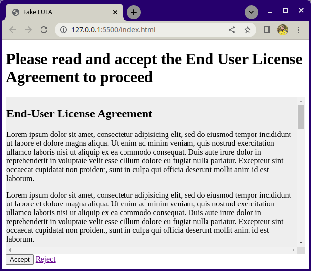

# Fake EULA (End User License Agreement)

This exercise is about practicing how to control `overflow` with CSS.

## What you will be doing

The task is to create a page that will be to shown to a user during the account registration process. The page contains an End User License Agreement that the user must approve to proceed with the registration. You will be provided with the files you need, and a basic structure to start from.

### Example

## Tasks

### Task 1

Examine the example image and open `index.html` with Live Server. Add the missing heading, button and link elements into `index.html`. Make the **Reject** link lead to another page, such as [https://example.org](https://example.org).

### Task 2

Add styling to `style.css` to make the page match the example screenshot as close as you can. In the example, the height of the gray EULA box is `20em`.

### Bonus task!

In the example the gray EULA box contains both horizontal and vertical scrollbars. Use CSS to make it so that only the vertical scrollbar is visible.

## Hints

- [MDN: overflow](https://developer.mozilla.org/en-US/docs/Web/CSS/overflow)
