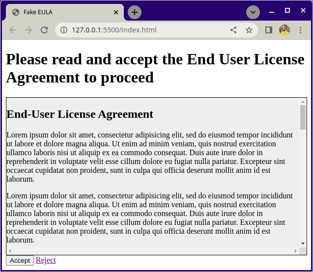

# EULA (Endbenutzer-Lizenzvereinbarung)

Diese Übung dreht sich darum, wie man mit CSS `overflow` kontrolliert.

## Was du tun wirst

Die Aufgabe besteht darin, eine Seite zu erstellen, die einem Benutzer während des Registrierungsprozesses angezeigt wird. Die Seite enthält eine Endbenutzer-Lizenzvereinbarung, die der Benutzer genehmigen muss, um mit der Registrierung fortzufahren. Dir werden die benötigten Dateien und eine grundlegende Struktur zur Verfügung gestellt.

### Beispiel

## Aufgaben

### Aufgabe 1

Betrachte das Beispielbild und öffne `index.html` mit Live Server. Füge die fehlenden Überschrift-, Schaltflächen- und Verknüpfungselemente in `index.html` ein. Lass den **Ablehnen**-Link zu einer anderen Seite führen, wie zum Beispiel [https://example.org](https://example.org).

### Aufgabe 2

Füge in `style.css` das Styling hinzu, um die Seite so nah wie möglich am Beispiel-Screenshot aussehen zu lassen. In dem Beispiel beträgt die Höhe des grauen EULA-Kastens `20em`.

### Bonusaufgabe!

Im Beispiel enthält der graue EULA-Kasten sowohl horizontale als auch vertikale Scrollleisten. Verwende CSS, um nur die vertikale Scrollleiste sichtbar zu machen.

## Hinweise

- [MDN: overflow](https://developer.mozilla.org/en-US/docs/Web/CSS/overflow)
